# Emergent Representations with DINO on CIFAR-10

This project trains and analyzes self-supervised DINO models on CIFAR-10. The goal is to study how useful visual representations emerge without class labels during training, then evaluate those representations through embedding plots and interpretability visualizations.

The repository now contains an end-to-end workflow:

1. Build DINO student and teacher networks.
2. Train on multi-view CIFAR-10 augmentations.
3. Save versioned checkpoints.
4. Extract learned embeddings from the trained student.
5. Visualize embeddings with PCA and t-SNE.
6. Generate interpretability dashboards using LRP, GradCAM, and attention rollout.
7. Store the generated results under `src/`.

## Model Versions

Three DINO variants were implemented and compared.

| Version | Backbone | Projection head | Centering | Main purpose |
| --- | --- | --- | --- | --- |
| `v1` | TinyCNN | Linear head | Off | Baseline DINO setup |
| `v2` | TinyCNN | MLP projection head | On | Stronger CNN representation learning |
| `v3` | ViT-Tiny | MLP projection head | On | Transformer-based representation learning with attention analysis |

The model code is organized around:

- `models.py`: TinyCNN, ViT-Tiny, projection head, and full DINO wrapper.
- `trainer.py`: student-teacher training loop, EMA teacher updates, mixed precision, gradient accumulation, and checkpoint saving.
- `loss.py`: DINO self-distillation loss.
- `run.py`: full train, evaluate, visualize, and interpret pipeline.
- `evaluate.py`: feature extraction from the trained student model.
- `visualize.py`: PCA, t-SNE, loss, and attention visualization helpers.
- `interpret.py`: LRP, GradCAM, attention rollout, batch explanations, and standalone checkpoint interpretation.

## Training Pipeline

Training uses CIFAR-10 images resized to `64x64`. Each image is converted into multiple augmented views using the DINO augmentation pipeline. The student sees all views, while the teacher sees only the global views.

The teacher is updated using exponential moving average of the student weights:

```text
teacher = momentum * teacher + (1 - momentum) * student
```

The current training configuration in `run.py` uses:

| Setting | Value |
| --- | --- |
| Dataset | CIFAR-10 |
| Image size | `64x64` |
| Training subset | `10,000` images |
| Batch size | `16` |
| Gradient accumulation | `4` steps |
| Effective batch size | `64` |
| Epochs | `100` |
| Optimizer | AdamW |
| Learning rate | `1e-4` |
| Scheduler | Cosine annealing |
| Device | CUDA if available, otherwise CPU |

To run the full pipeline:

```bash
python run.py
```

To run interpretability from an existing checkpoint without retraining:

```bash
python interpret.py --checkpoint artifacts/dino_v1.pt --version v1 --num-samples 6 --dashboard src/interp/explain_dashboard_v1.png --batch src/interp/batch_explain_v1.png --values src/interp/interpretability_values_v1.npz
```

Change `v1` to `v2` or `v3` and point to the matching checkpoint to reproduce the other outputs.

## Representation Results

After training, student embeddings are extracted and projected to 2D using PCA and t-SNE. These plots show whether CIFAR-10 classes begin to separate in the learned feature space even though DINO training itself does not use labels.

### PCA

| v1 | v2 | v3 |
| --- | --- | --- |
| 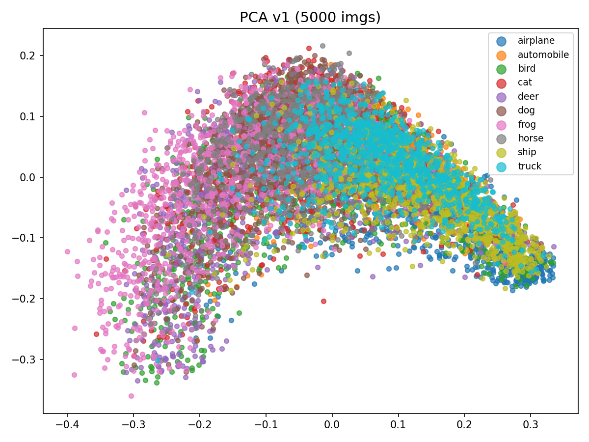 | 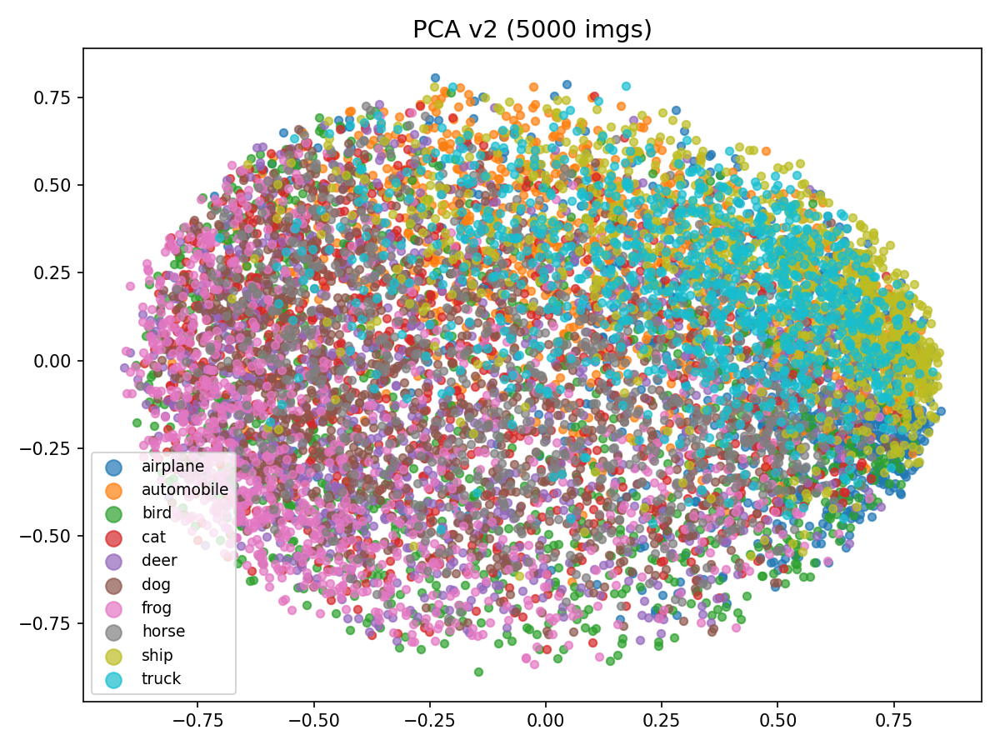 | 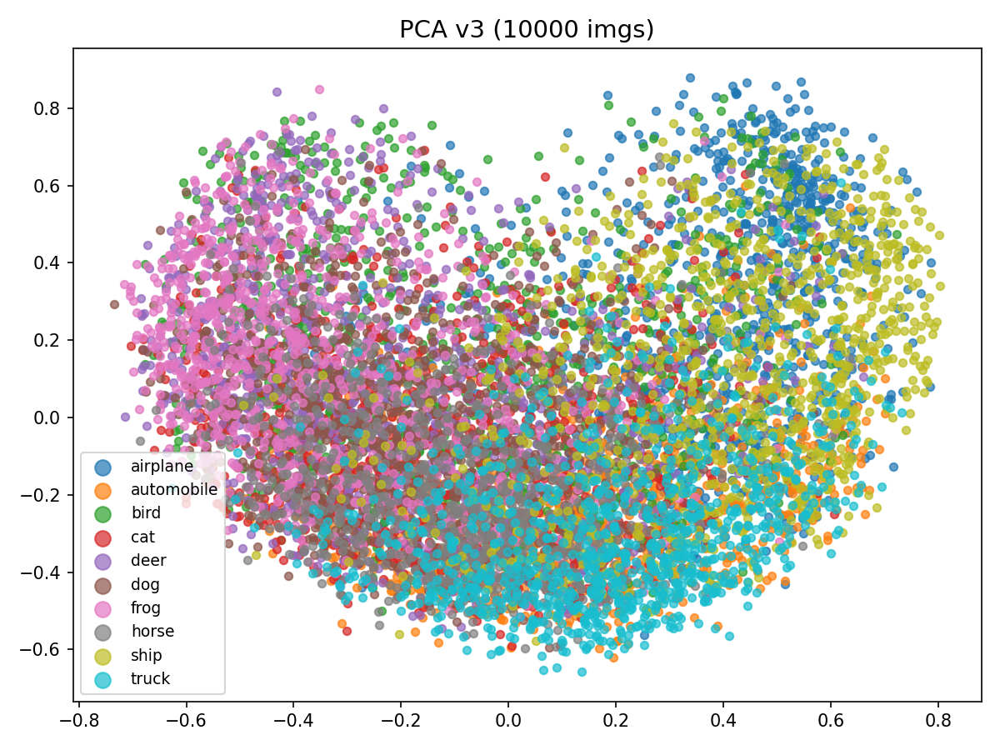 |

### t-SNE

| v1 | v2 | v3 |
| --- | --- | --- |
| 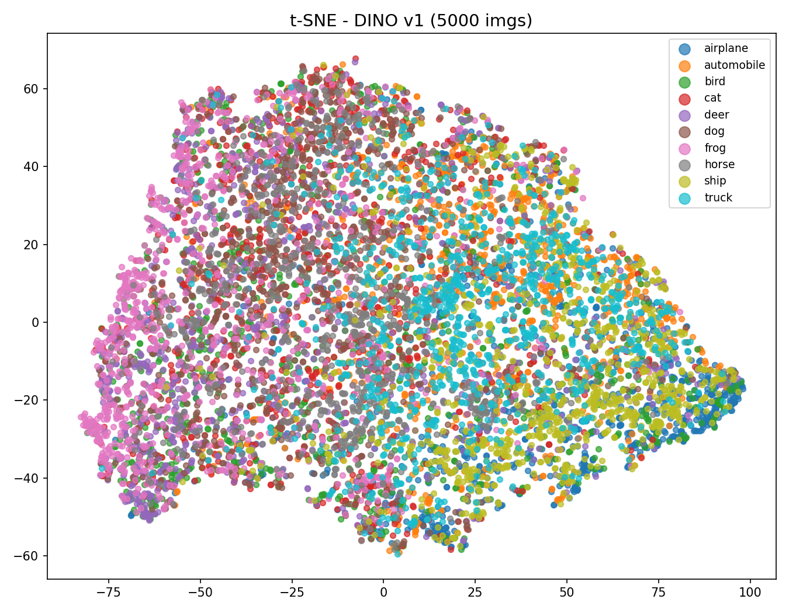 | 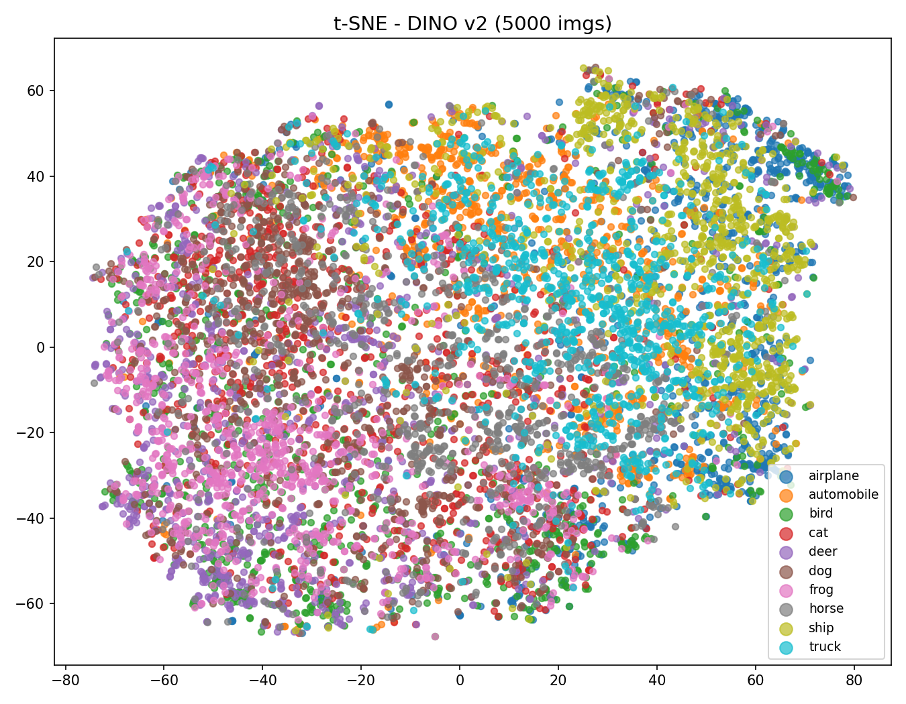 | 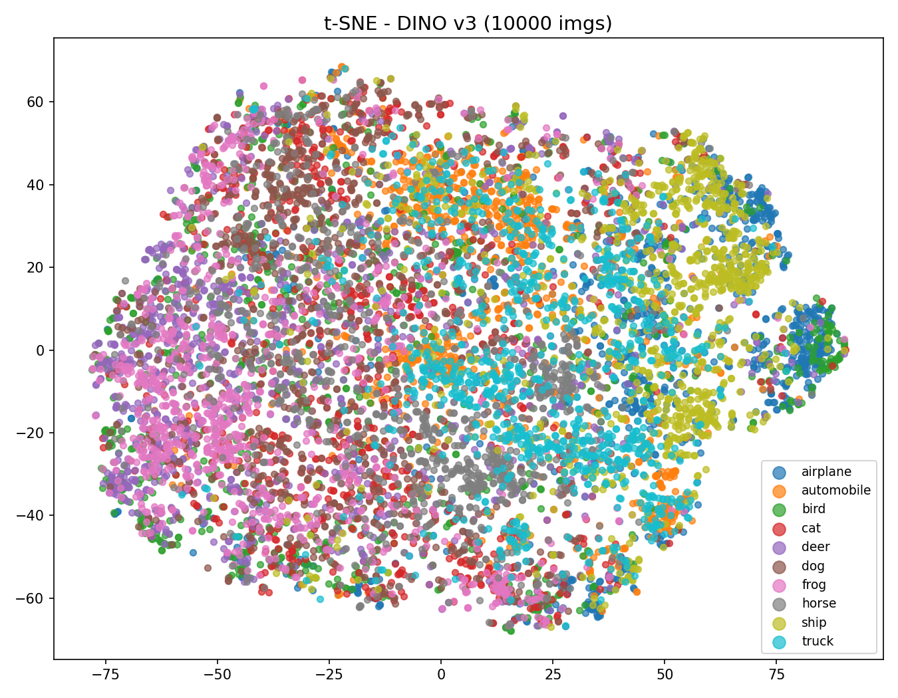 |

## Training Loss

The loss curves track the DINO objective over training. They are stored per version so each run can be inspected independently.

| v1 | v2 | v3 |
| --- | --- | --- |
| 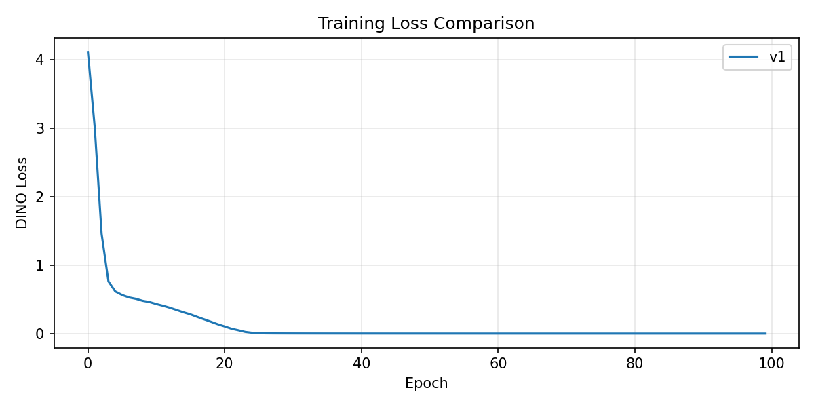 | 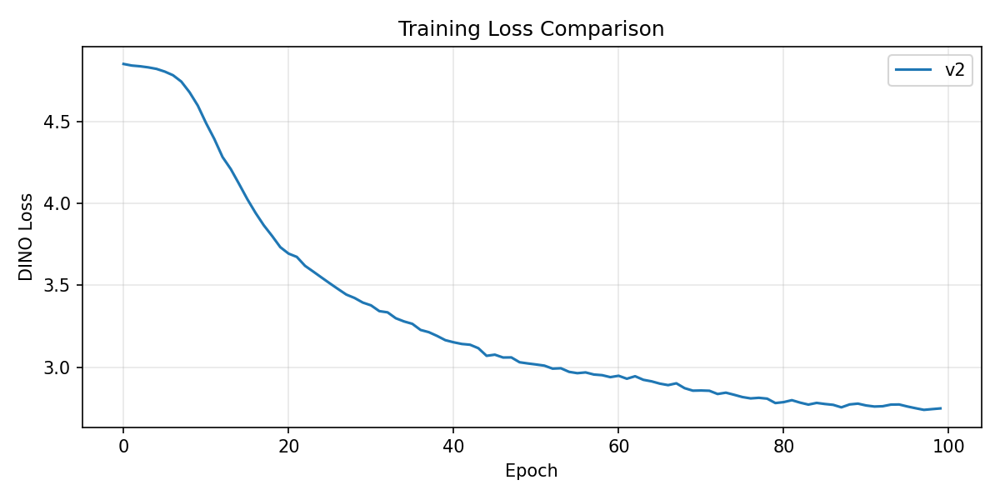 | 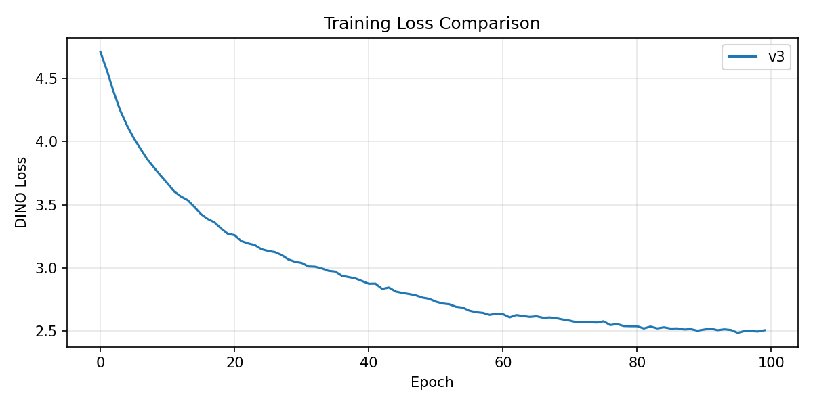 |

## Interpretability

The interpretability pipeline explains what image regions contributed to the learned representation.

For CNN-based versions (`v1`, `v2`), the dashboard combines:

- Original CIFAR-10 image.
- LRP relevance map.
- GradCAM heatmap.
- Combined relevance overlay.

For the ViT-based version (`v3`), the dashboard uses:

- Original CIFAR-10 image.
- ViT LRP relevance.
- Attention rollout.
- Combined relevance overlay.

### Single Image Dashboards

| v1 | v2 | v3 |
| --- | --- | --- |
| 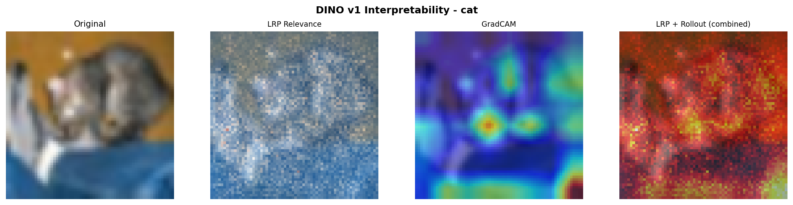 | 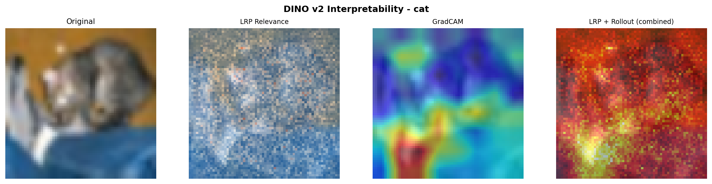 | 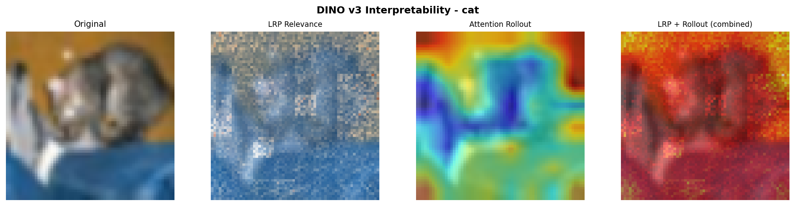 |

### Batch Explanations

| v1 | v2 | v3 |
| --- | --- | --- |
| 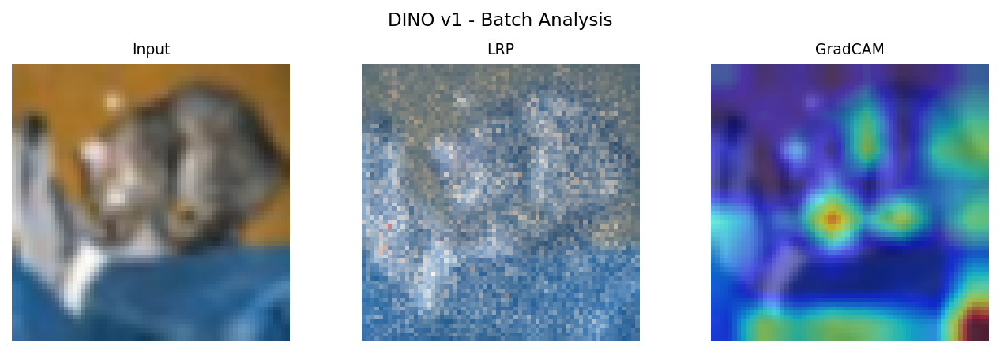 | 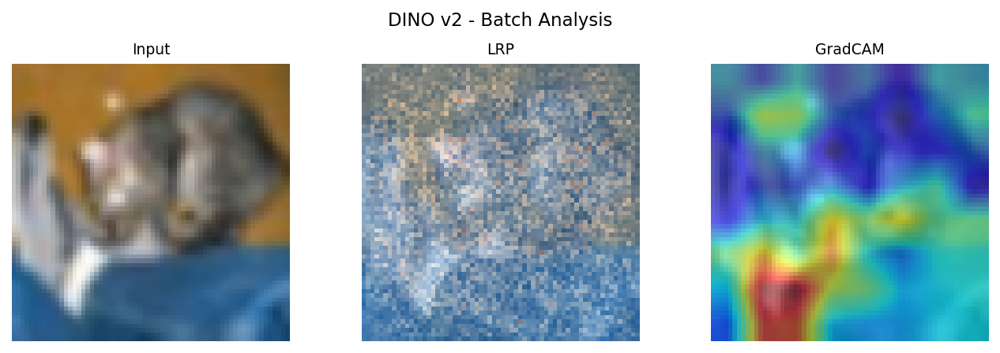 | 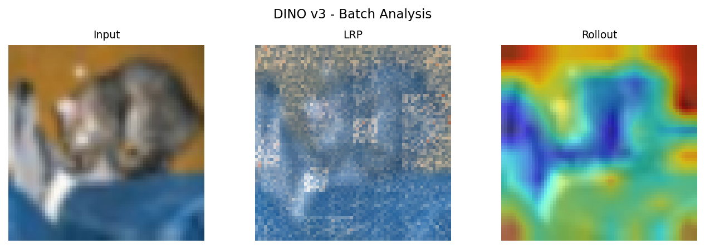 |

The raw interpretability arrays are also saved for later analysis:

- `src/interp/interpretability_values_v1.npz`
- `src/interp/interpretability_values_v2.npz`
- `src/interp/interpretability_values_v3.npz`

## Fixes Added During Development

The standalone interpretability path in `interpret.py` was added so explanations can be generated from saved checkpoints without rerunning training.

A CUDA device mismatch in ViT attention rollout was also fixed. The rollout accumulator now uses the same device and dtype as the attention tensors:

```python
first_attn = all_attn[0]
rollout = torch.eye(
    first_attn.shape[-1],
    device=first_attn.device,
    dtype=first_attn.dtype,
)
```

This prevents CPU/CUDA matrix multiplication errors during attention rollout.

## Output Directory

Current generated outputs in `src/`:

```text
src/
  loss_curves_v1.png
  loss_curves_v2.png
  loss_curves_v3.png
  pca_embeddings_v1.png
  pca_embeddings_v2.png
  pca_embeddings_v3.png
  tsne_embeddings_v1.png
  tsne_embeddings_v2.png
  tsne_embeddings_v3.png
  interp/
    explain_dashboard_v1.png
    explain_dashboard_v2.png
    explain_dashboard_v3.png
    batch_explain_v1.png
    batch_explain_v2.png
    batch_explain_v3.png
    interpretability_values_v1.npz
    interpretability_values_v2.npz
    interpretability_values_v3.npz
```

## Summary

This project now covers the complete DINO workflow from training to analysis. The training code learns self-supervised visual representations from CIFAR-10, the evaluation code projects those embeddings into interpretable 2D plots, and the interpretability code explains what each trained model attends to or uses when processing images.

The images in `src/` are the final report artifacts for comparing representation quality, training behavior, and model explanations across `v1`, `v2`, and `v3`.
